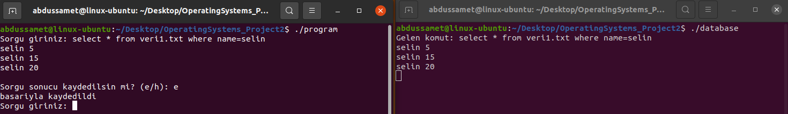
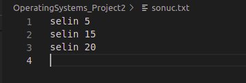
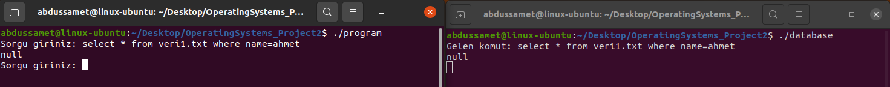
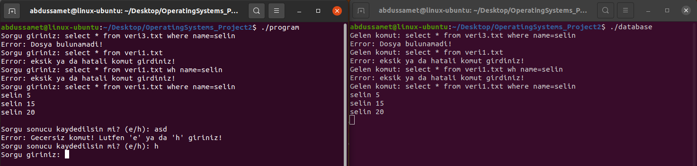

# Database Management System (with pipe)
In this application, a simple database application has been developed by communicating between processes.
There are 2 datasets as txt file (veri1.txt and veri2.txt). In the files, there are records of name and number values.

```
[name] [value]
```

## Open App


This application consists of 2 applications. One of them is the database and the other are the main application that 
the client will use. The database only listens to the queries it receives and returns the appropriate data to the 
client. The program, on the other hand, constantly expects us to enter a query.

## Save the Results


This program saves the results returned from the query to a text file.

## No Results


If there are no result, return null.

## Missing or Incorrect Command


## Exit

